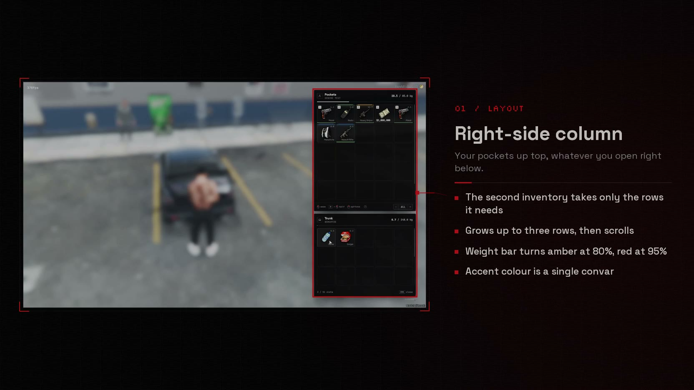
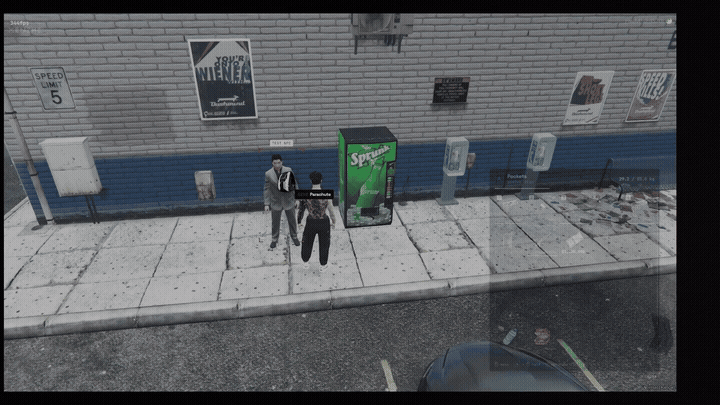

<div align="center">

# ox_inventory · Xenzhe edit

A redesign of [ox_inventory](https://github.com/overextended/ox_inventory) focused on feel: a compact, right-side layout, a context menu that handles quantities, drag-to-give and drag-to-drop straight into the world, and item rarity. Everything else is the ox_inventory you already run.

Built on ox_inventory **v2.47.9** by [Overextended](https://github.com/overextended). Released under the same GPL-3.0 licence.

[](.github/media/showcase.mp4)

**[▶ Watch the showcase](.github/media/showcase.mp4)** (58 s)

</div>



## What's different

### Layout

- Your inventory sits on the right side of the screen. Trunks, gloveboxes, stashes, shops and crafting benches open right below it.
- The secondary inventory only takes the rows it needs: a 5-slot glovebox is exactly one row. Bigger inventories grow upwards up to three rows and then scroll.
- The empty "ground" inventory no longer opens with your pockets. A nearby pile that actually has items still shows up so you can pick them up.
- Panels have a header with the inventory type, owner or plate, and a weight bar that turns amber at 80% and red at 95%.

### Slots

- Hotbar number, per-slot weight, stack count and durability as a thin line along the bottom edge (green, amber, red).
- Single items show their name. Money shows as `$184,250`.
- Items you can't buy or craft are clearly dimmed. Out of stock shows a red `0`.
- Broken or missing images no longer show the browser's broken image icon.

### Context menu

- Right-click an item to pick an amount (`−` / `+`, mouse wheel, `½`, `All`) before acting on it.
- **Give**, **Split**, **Move to &lt;trunk / stash&gt;** and **Drop** all use that amount and show it next to the action.
- Weapon options (remove ammo, attachments, copy serial) and custom item buttons are still there.

### Drag into the world

- Drag an item out of the panels and they fade so you can see the world.
- Nearby players are framed on screen. Drop on one to give them the item: both play the give and receive animations.
- Players out of range or out of sight are marked and can't receive.
- Drop anywhere else to throw the item on the ground.
- Shift still gives or drops half the stack. The amount box works as before.
- Giving from the world goes through its own server callback with a real distance check and a rate limit, then reuses ox_inventory's own give logic (hooks, slot locks, carry weight).

### Rarity

- Optional `rarity` field on items and weapons: `common`, `uncommon`, `rare`, `epic`, `legendary`, or any hex colour.
- Rare and above get a coloured edge on the slot. Every tier shows in the tooltip.
- Weapons ship with sensible defaults: pistols are common, SMGs rare, snipers legendary.

```lua
['phone'] = {
    label = 'Phone',
    rarity = 'uncommon',
    weight = 190,
},
```

### Look and feel

- Space Grotesk and JetBrains Mono, bundled with the resource (no Google Fonts request from inside the game).
- Tooltip with a clean stat sheet: weight per unit and total, durability meter, ammo, serial, attachments, crafting ingredients and time.
- Mouse and key hints drawn as icons instead of text, plus a help panel with every shortcut.
- Hotbar and item notifications (`+3`, `-250`, `equipped`) restyled to match.
- No blur, no opaque backgrounds: the game stays visible behind the UI.
- Every string goes through the locale files. English and Spanish are complete; other languages fall back to English for the new strings.

## Configuration

All new options are convars, set them in your `server.cfg`:

| Convar | Default | |
|---|---|---|
| `setr inventory:accent` | `#c1121f` | Accent colour for the UI (hex). |
| `setr inventory:worldgive` | `true` | Allow giving items by dragging them onto players. |
| `setr inventory:worldgivedistance` | `3.0` | Max distance in metres for drag-to-give. |

Everything from the original ox_inventory config still applies.

## Testing

`/testdrag` (admins only) spawns a test NPC in front of you so you can try drag-to-give without a second player. Run it again to remove it, or `/testdrag open` to see what it received.

## Building the UI

The release zip ships with the UI already built. If you change anything in `web/`:

```bash
cd web
bun install
bun run build
```

`bun run start` opens a development sandbox in the browser with ready-made scenarios (trunk, glovebox, huge stash, shop, crafting, ground pile, frisking another player, overweight, empty), a language and accent switcher, a mocked server for use / give / buy / craft, and a live log of every NUI callback.

## Installation

Replace your existing `ox_inventory` folder with this one and restart. Your database, items and config stay as they are. Same dependencies as the original: [ox_lib](https://github.com/overextended/ox_lib), [oxmysql](https://github.com/overextended/oxmysql) and OneSync.

For everything else (items, shops, stashes, exports, hooks), the official documentation is still the reference: https://overextended.dev/docs/ox_inventory

## Supported frameworks

Same as upstream: [ox_core](https://github.com/overextended/ox_core), [esx](https://github.com/esx-framework/esx_core), [qbox](https://github.com/Qbox-project/qbx_core) and [nd_core](https://github.com/ND-Framework/ND_Core).

## Credits

- [Overextended](https://github.com/overextended) for ox_inventory. All the core inventory logic, security and framework support is theirs.
- [Space Grotesk](https://github.com/floriankarsten/space-grotesk), [JetBrains Mono](https://github.com/JetBrains/JetBrainsMono) and [Silkscreen](https://github.com/googlefonts/silkscreen), SIL Open Font License 1.1.
- Icons based on [Lucide](https://lucide.dev), ISC License.

## Licence

GPL-3.0, same as ox_inventory. See [LICENSE](./LICENSE) and [NOTICE.md](./NOTICE.md).

Made by [Xenzhe](https://xenzhe.com).
